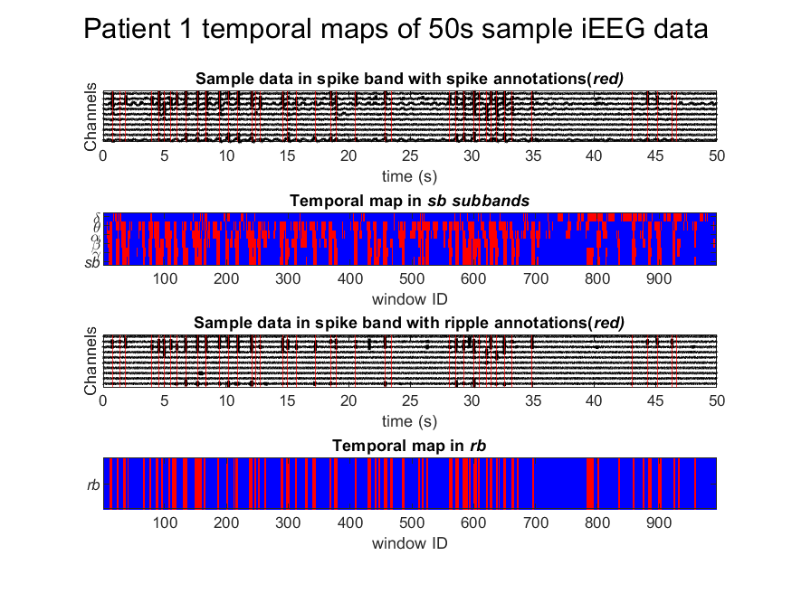
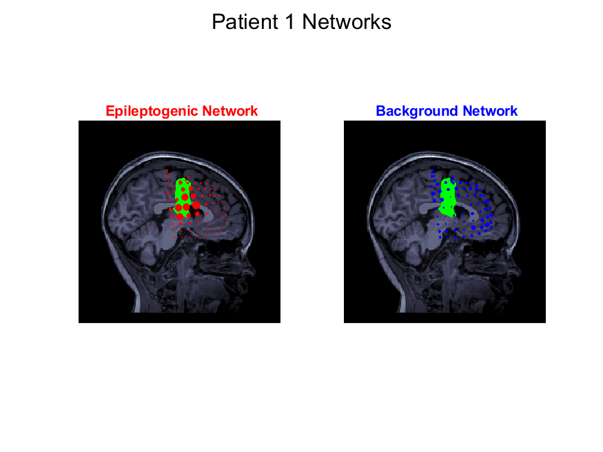
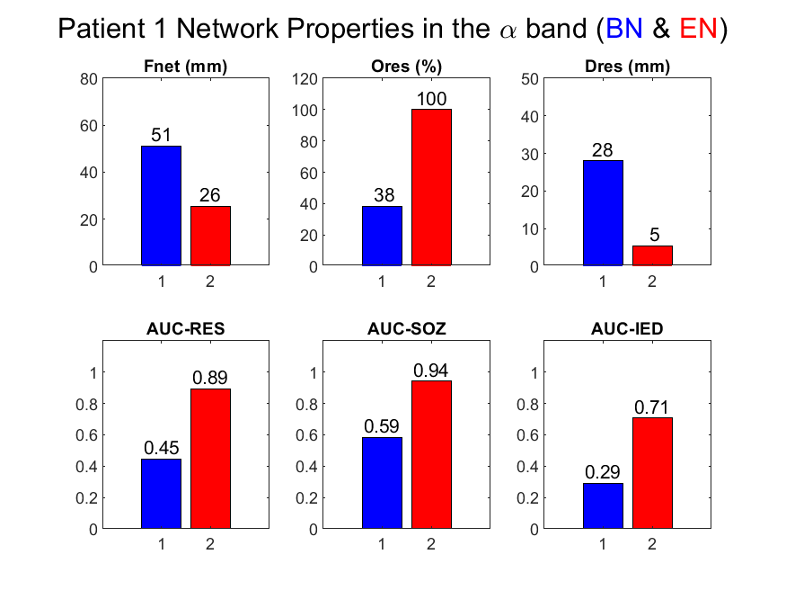
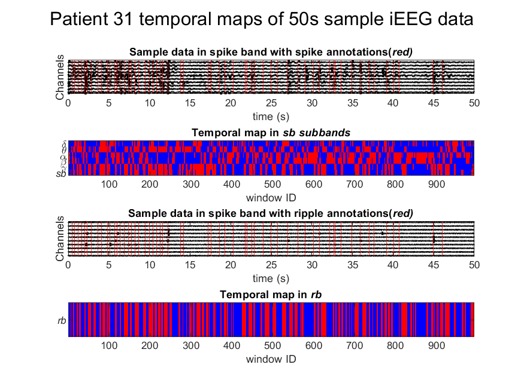
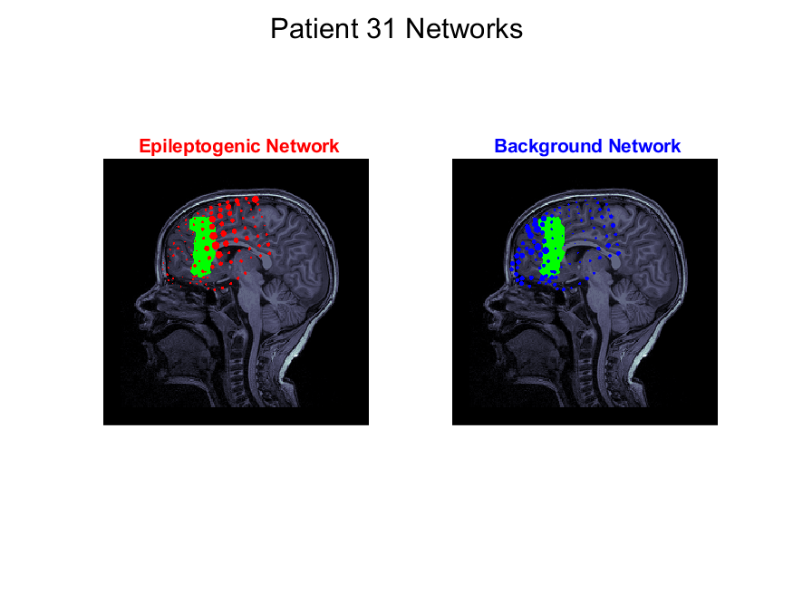
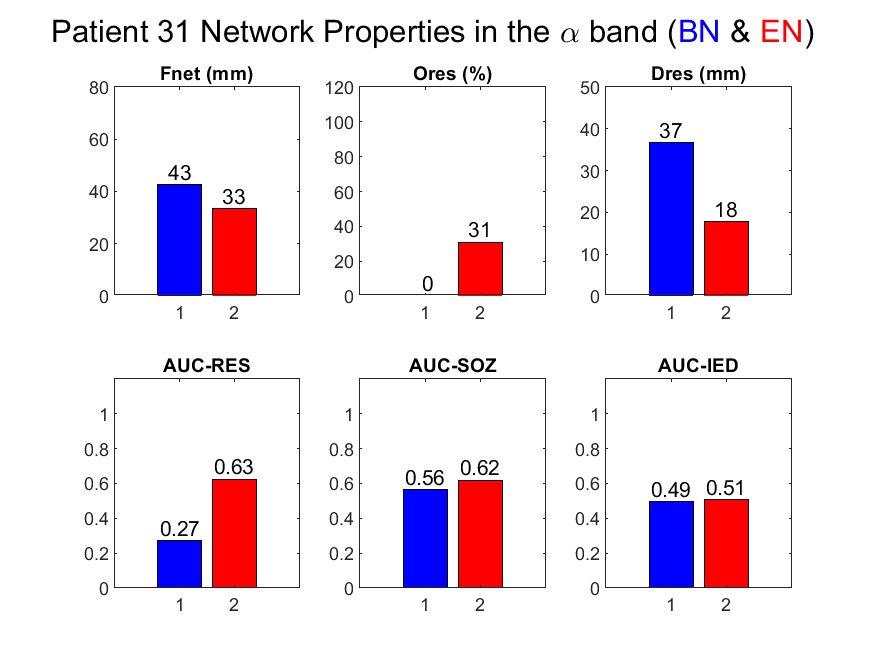

**MATLAB Code Manual for**

**Machine Learning on Interictal Intracranial EEG Predicts Surgical Outcome in Drug Resistant Epilepsy**

Hmayag Partamian, Saeed Jahromi, Ludovica Corona, M Scott Perr, Eleonora Tamilia, Joseph R. Madsen, Jeffrey Bolton, Scellig S.D. Stone, Phillip L. Pearl, Christos Papadelis


<p align="center">
  
</p> 

**Figure 1**. **Overall processing pipeline.** **a** Coregistration of MRI and computed tomography (CT) with intracranial implantations to identify the intracranial EEG (iEEG) electrode coordinates. Preoperative and postoperative MRIs were used to define the resected volume. The resection and clinically defined seizure onset zone (SOZ) were used as gold standards for the epileptogenic zone (EZ) prediction. **b** Five minutes of n-channel iEEG data filtered in two frequency bands, i.e., spike band (sb) [1-80 Hz] and ripple band (rb) [80-250 Hz], using Butterworth filters. In each band, data were dissected into d ms (250 and 150 ms for sb and rb, respectively) time-windows through a sliding window approach with 95% overlap resulting in L time-windows (L_1 for sb and L_2 for rb). Each time-window was processed using dynamic mode decomposition (DMD) with h time delay embeddings to extract r_1 (for  sb) and r_2 (for rb) oscillatory components and their corresponding DMD spectra per channel. The DMD spectra matrices contain coherent spatial maps (DMD power spectra across channels) per component across all time-windows. **c** The feature matrices were constructed by averaging the DMD spectral powers of the components of each channel in the seven physiologically relevant frequency bands [delta (δ = 1-4 Hz), theta (θ= 4-8 Hz), alpha (α = 8-12 Hz), beta (β = 12-30 Hz), gamma (γ = 30-80 Hz), spike band (sb = 1-80 Hz), and ripple band (rb = 80-250 Hz)], and scaled between 0 and 1. The entire network was then computed by averaging the feature matrices across time-windows in each frequency band. Next, the unsupervised machine learning (ML) method [non-negative matrix factorization (NNMF)] automatically extracted for each frequency band two brain networks and their corresponding temporal map. **d** The two networks were categorized as epileptogenic (red-colored) and background (blue-colored). Three network properties were then computed: focality, overlap with resection, and distance from resection. **e** The temporal maps in different frequency bands showed the active segments of the epileptogenic (red-colored) and background (blue-colored) networks across time which were concordant with interictal epileptiform discharge (IED) (pink-colored) and ripple annotations (purple-colored). 


**Table of Contents**

* [**Folders** 1](#_Toc178680894)
* [**Prerequisites** 2](#_Toc178680895)
* [**Installation time** 3](#_Toc178680896)
* [**Expected runtime** 3](#_Toc178680897)
* [**Getting started** 3](#_Toc178680898)
* [**Loading data** 3](#_Toc178680899)
* [**Processing pipeline** 4](#_Toc178680900)
* [**Output of the code** 5](#_Toc178680901)
* [**Expected output** 5](#_Toc178680902)
* [**Good-outcome patient 1** 5](#_Toc178680903)
* [**Temporal maps** 5](#_Toc178680904)
* [**Epileptogenic and background networks in the band** 6](#_Toc178680905)
* [**Properties of networks in the band** 6](#_Toc178680906)
* [**Poor-outcome patient 31** 7](#_Toc178680907)
* [**Temporal Maps** 7](#_Toc178680908)
* [**Epileptogenic and background networks in the band** 8](#_Toc178680909)
* [**Properties of networks in the band** 8](#_Toc178680910)
* [**Running the framework on your own data** 9](#_Toc178680911)
* [**References** 9](#_Toc178680912)

# **Folders**


```bash 
.
├── LICENSE
├── README.md
├── anatomy
│   ├── CT_P1.nii
│   ├── CT_P31.nii
│   ├── MRI_P1.nii
│   └── MRI_P31.nii
├── figures
│   ├── background_network_P1.png
│   ├── background_network_P31.png
│   ├── epileptogenic_network_P1.png
│   ├── epileptogenic_network_P31.png
│   ├── temporal_map_P1.png
│   ├── temporal_map_P31.png
│   ├── properties_P1.png
│   └── properties_P1.png
├── functions
│   ├── distiance_electrodes_to_resection.m
│   ├── DMDfull.m
│   ├── Extract_networks_and_temporal_maps.m
│   ├── extractFeatures.m
│   └── getIndices.m
├── results
├── sample_data
│   ├── sample_data_P1.mat
│   ├── sample_data_P31.mat
│   ├── compute_spike_boundary.m
│   ├── postprocessing_v2.m
│   └── spike_detector_hilbert_v25.m
├── demo_run_P1.m
└── demo_run_P31.m
```


# **Prerequisites**

MATLAB (we applied the framework with MATLAB R2022a and 2024a)
- The following MATLAB toolboxes need to be installed:
		-‘Signal Processing Toolbox’
		-‘Statistics and Machine Learning Toolbox’
		-‘Image Processing Toolbox’ 
- Dynamic Mode Decomposition (DMD) code ‘DMDfull.m’1, (http://dmdbook.com/)
- Windows, macOS, or Linux operating system

Note: Brainstorm2 was used to process and analyze most of the 3D data, but it is not a prerequisite to run the code. 


# **Installation time**
None. Simple unzipping and preparation of the script (fixing paths and preparing your data in the format specified).

# **Expected runtime**
The experiments were performed on a Dell desktop with 12th Gen Intel(R) Core (TM) i9-12900   2.40 GHz with 128 GB RAM, and 64-bit operating system (x64-based processor) Windows 10.
To process 50-second intracranial EEG (iEEG) with 80-120 channels, with sampling frequency of 1999 Hz, using 95% overlap, and using MATLAB 2024a, the expected overall running time is around 50-90 seconds.
Note: runtime on Code Ocean takes around 1.5 hours for some reason. 3D figures are the reason behind this delay. It is recommended to download the code and run it on a local computer.


# **Code Link**
The code is available on Code Ocean page https://codeocean.com/capsule/2419340/tree  which set as private and can be shared from the corresponding author upon request. The code will also be available on github.

# **Getting started**
After running MATLAB and downloading and unzipping the code folder, set the current workspace to the repository folder, adjust the paths in the scripts to their corresponding paths, and run the demo_run_P1.m (Good outcome patient) or demo_run_P31.m (Poor Outcome Patient)

demo_run_P1.m 
demo_run_P31.m

The demo scripts will automatically perform the following:
•	Read and preprocess the data, extract the features and the networks, and identify the epileptogenic and background networks. 
•	Generate the temporal maps with a sample data with annotations in both the spike and ripple bands.
•	Compute the network properties and evaluate the receiver operating characteristic (ROC)  area under the curve (AUC) with resection, with seizure onset zone (SOZ), and temporal map concordance with interictal epileptiform discharges (IED). 

# **Loading data**
The demo scripts will use the data of two patients sampled from our cohort. P1 was seizure free (good outcome, Engel=I) and P31 had recurring seizures (poor outcome, Engel>I).
sample_data_P1.mat
sample_data_P31.mat
After these MATLAB files are loaded, they contain the following variables:
	Fs : sampling frequency.
	iEEG : 50 second n-channel interictal iEEG data. 
	time : time in seconds, [m×1].
	channel_coordinates: contain the coordinates of the implanted n electrodes, [n×1].
	soz_channels : contains a vector of size n with 0’s (non-SOZ) and 1’s (SOZ).
	resection_coordinates : contains the coordinates of the resection volume.
	spike_annotation : contains the annotations of spikes in time.
	ripple_annotation : contains the annotations of ripples in time.
	CustomColormap : a custom colormap used to set the desired network colors (red for epileptogenic and blue for background).

Note: We provided the MRI and post-implantation CT in NIfTI format in the anatomy folder (MRI_P1.nii, MRI_P31.nii,CT_P1.nii, CT_P31.nii) in case the user wants to process the data from scratch. We used these files to coregister the CT and MRI and extract the channel coordinates of the provided data. 


# **Processing pipeline**

The code runs by calling different functions listed in the function folder and performs the following pipeline:
a)	The data is first filtered in the spike band [1-80 Hz] using 4th order Butterworth filter (MATLAB)
b)	After setting the percentage of overlap (perc), number of modes (r_input), and window size parameter offset, the extractFeatures function dissects the data into windows, applies the DMD, and outputs the DMD spectral power features, the mean frequency of modes across windows, and the spike labels of each window.
c)	The mean frequencies are processed using getIndices function to identify indices of the modes that fall within each of the six bands for the spike band analysis.
d)	Extract_networks_and_temporal_maps function takes the indices and the DMD spectral powers across windows to find the dominantly reoccurring spatial configurations and their corresponding activity across windows. The function also identifies the epileptogenic and background networks and outputs the indices of the temporal maps. 
e)	Steps 1-4 are repeated in the ripple band [80-250 Hz] and ripple annotations to extract the epileptogenic and background networks and their temporal maps in the ripple band.
f)	The temporal maps and networks can now be visualized via plots.
g)	The network properties (focality, overlap with resection, and distance from resection) are computed.
h)	AUC with SOZ, resection, and ripple and spike annotations are then computed to generate the properties plots that make use of the SOZ, resection volume, and the annotations provided. 


# **Output of the code**
The code outputs:
	The time series data, the annotations (spikes and ripples), and the temporal maps in the spike and the ripple bands.
	The networks projected on the MRI as well as the resection volumes.
	The network properties [focality (F_net), overlap with resection (O_res), and distance from resection (D_res)] , and AUC with the SOZ (AUC-SOZ), resection (AUC-RES), and the AUC of the active time-windows with the annotated timestamps of the IEDs and ripples (AUC-IED). 
Frequency bands: Frequency bands: delta (δ= 1-4 Hz), theta (θ= 4-8 Hz), alpha (α = 8-12 Hz), beta (β = 12-30 Hz), gamma (γ=  30-80 Hz), spike band (sb = 1-80 Hz), and ripple band (rb = 80-250 Hz).


# **Expected output**
The code outputs:
	The time series data, the annotations (spikes and ripples), and the temporal maps in the spike and the ripple bands.
	The networks projected on the MRI as well as the resection volumes.
	The network properties [focality (F_net), overlap with resection (O_res), and distance from resection (D_res)] , and AUC with the SOZ (AUC-SOZ), resection (AUC-RES), and the AUC of the active time-windows with the annotated timestamps of the IEDs and ripples (AUC-IED). 
Frequency bands: Frequency bands: delta (δ= 1-4 Hz), theta (θ= 4-8 Hz), alpha (α = 8-12 Hz), beta (β = 12-30 Hz), gamma (γ=  30-80 Hz), spike band (sb = 1-80 Hz), and ripple band (rb = 80-250 Hz).


## **Good-outcome patient 1**
The following results are expected when running demo_run_P1.m.
### **Temporal maps**

<p align="center">
  
</p> 

**Figure 2**. **Temporal maps in the spike and ripple bands of good outcome patient #1.** Sample intracranial EEG (50s) in the spike band with spike annotations (red vertical lines) and its corresponding temporal maps generated using our framework. Sample iEEG (50s) in the ripple band with ripple annotations (red vertical lines) and its corresponding temporal maps generated from the framework. Red timestamps in the temporal map are time-windows where the epileptogenic network is active, whereas the blue timestamps represent the time-windows where the background network is active.

### **Epileptogenic and background networks in the band**

<p align="center">
  
</p> 

**Figure 3**. **Epileptogenic and background network properties in the α band for good outcome patient #1.** The focality (F_net, mm), overlap with resection (O_res, %), and distance from resection (D_res, mm), area under the curve (AUC) for predicting resection (AUC-RES),  SOZ (AUC-SOZ), and the AUC of the temporal map for predicting interictal epileptiform discharges (AUC-IED) of the epileptogenic (red-colored) and background (blue-colored) networks.

<p align="center">
  
</p> 


**Figure 4**. **Epileptogenic and background network properties in the band and predictive power of good outcome patient 1.** The focality, overlap with resection, and distance from resection, AUC with resection, AUC with SOZ, and the AUC of the temporal map with IED of the epileptogenic (red) and background (blue) networks.

## **Poor-outcome patient 31**

The following results are expected when running demo_run_P31.m.

### **Temporal Maps**

<p align="center">
  
</p> 

**Figure 5**. **Temporal maps in spike and ripple bands of poor outcome patient #31.** Sample intracranial EEG (50s) in the spike band with spike annotations (red vertical lines) and its corresponding temporal maps generated from the framework. Sample iEEG (50s) in the ripple band with ripple annotations (red vertical lines) and its corresponding temporal maps generated from the framework.  Red timestamps in the temporal map are the time-windows where the epileptogenic network is active, whereas the blue timestamps represent the time-windows where the background network is active.

### **Epileptogenic and background networks in the band**

<p align="center">
  
</p> 

**Figure 6**. **Epileptogenic and background networks in the θ band of poor outcome patient #31.** The epileptogenic (red-colored) and background (blue-colored) networks generated by the framework are projected onto the MRI and overlapped with the resection volume (green-colored).

### **Properties of networks in the band**
<p align="center">
  
</p> 

**Figure 7 Epileptogenic and background network properties in the θ band for poor outcome patient 31.** The focality (F_net, mm), overlap with resection (O_res, %), and distance from resection (D_res, mm), area under the curve (AUC) for predicting resection (AUC-RES),  SOZ (AUC-SOZ), and the AUC of the temporal map for predicting interictal epileptiform discharges (AUC-IED) of the epileptogenic (red-colored) and background (blue-colored) networks.

# **Running the framework on your own data**

To run the framework on your own data, consider the following steps:
1.	Extract clean artifact-free interictal iEEG data segments.
2.	Preprocess the data with a notch filter to remove power line interference.
3.	Remove bad channels.
4.	Save the data as ieeg.mat file.
5.	Make sure to specify the Fs and time.
6.	Extract channel coordinates by coregistration of post-implantation MRI with CT. 
7.	Add the resection volume coordinates, SOZ electrodes, and spike and ripple annotations if availa-ble to extract network properties if available.
8.	Make sure the following variables are available in your MATLAB workspace:
•	Fs : sampling frequency of your data
•	ieeg: segment of iEEG data. 
•	time : time in seconds.
•	channel_coordinates : containing the coordinates of the implanted electrodes.
•	soz_channels : contains a vector of 0’s (non-SOZ) and 1’s (SOZ).
•	resection_coordinates : contains the coordinates of the resection volume.
•	spike_annotation : contains the annotations of spikes in time.
•	ripple_annotation : contains the annotations of ripples in time.
•	CustomColormap : a custom colormap used to set the desired network colors (red for epileptogenic and blue for background). Use the one provided with our data.
9.	Update the demo code (variable names and paths) and run.
10.	To plot the networks, you may need to generate the 3D view of the of the provided NIfTI anat-omy files, coregister the CT on a software like Brainstorm and plot the networks. 

# **References**

1\. Kutz, J. N., Brunton, S. L., Brunton, B. W. & Proctor, J. L. _Dynamic Mode Decomposition_. (Society for Industrial and Applied Mathematics, Philadelphia, PA, 2016). doi:10.1137/1.9781611974508.

2\. Tadel, F., Baillet, S., Mosher, J. C., Pantazis, D. & Leahy, R. M. Brainstorm: A User-Friendly Application for MEG/EEG Analysis. _Computational Intelligence and Neuroscience_ **2011**, 879716 (2011).